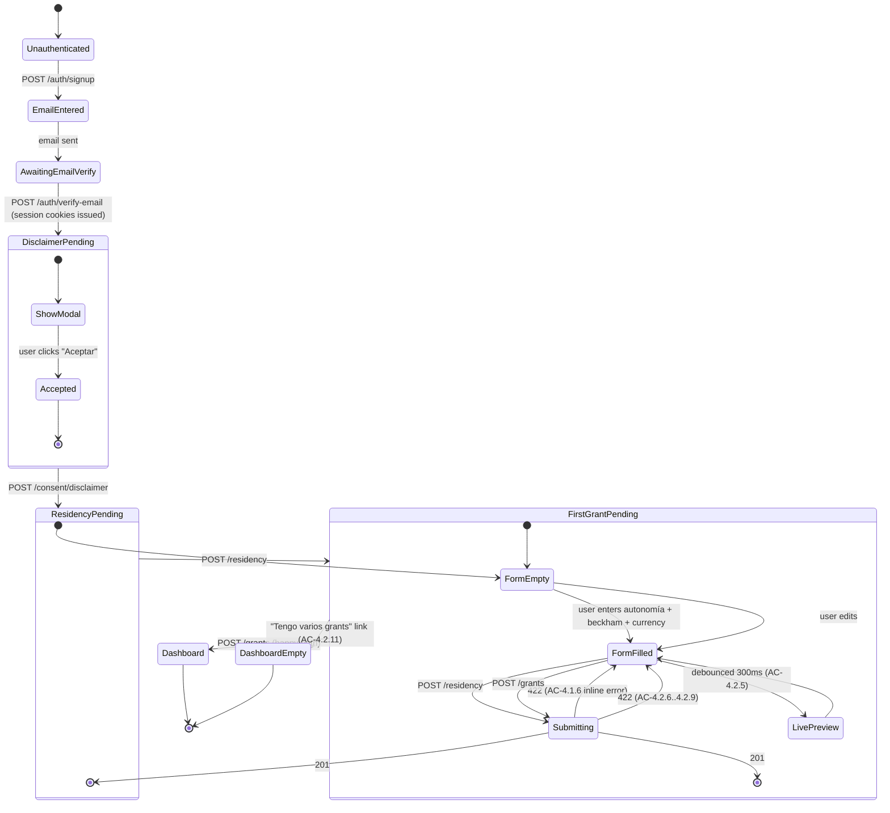

# ADR-014: Slice-1 technical design

- **Status:** Proposed
- **Date:** 2026-04-18
- **Deciders:** Ivan (owner)
- **Traces to:** `docs/requirements/slice-1-acceptance-criteria.md` (authoritative for this slice), `docs/requirements/v1-slice-plan.md` (Slice 1 non-goals), ADR-005 (entities), ADR-009 (frontend), ADR-010 (API), ADR-011 (auth), ADR-013 (scaffold), SEC-020..SEC-026 (RLS), SEC-050 (log allowlist), SEC-100..SEC-103 (audit log), SEC-160..SEC-163 (rate limit + validation), UX §4.1 + `grant-detail.html` + `dashboard.html`.

## Context

Slice 1's boundary is explicit: **sign up → residency → first grant → dashboard with vesting timeline**. No tax math. No FX. No CSV. No exports. No scenarios. No sell-now. No rule-set chip. No Modelo 720.

Per the slice-1 acceptance-criteria document this is "implementation-ready" on the requirements side but leaves concrete DDL, the vesting-derivation algorithm, the signup wizard state machine, and the end-to-end sequence diagram to the architect. This ADR produces all four and a short list of what Slice 1 explicitly defers (so the implementation engineer is never ambiguous about a TBD).

The assumption set from C-4 (EUR conversion deferred from Slice 1 to Slice 3) is load-bearing — the ECB pipeline is **not built in Slice 1**. Section "Assumptions and escalations" records this and the cost of the opposite decision.

## Decision

### 1. Slice-1 DDL (concrete)

All migrations live under `migrations/`. Numbering is `YYYYMMDDHHMMSS_label.sql`. Slice 0 ships `20260418120000_init.sql` with the auth tables listed in ADR-011 §Schema additions and ADR-013 §Local dev; Slice 1 adds `20260425120000_slice_1.sql` with grants, vesting events, residency periods, and the consent-acceptance audit hooks.

Below is the **authoritative DDL for the tables Slice 1 needs** — `users`, `sessions`, `email_verifications`, `password_reset_tokens`, `audit_log`, `residency_periods`, `grants`, `vesting_events`. `rule_sets`, `calculations`, `scenarios`, and all others listed in ADR-005 ship empty in Slice 0 or land in later slices; they are not included here.

```sql
-- migrations/20260418120000_init.sql (Slice 0 subset relevant to Slice 1)
-- EXTENSIONS
CREATE EXTENSION IF NOT EXISTS "pgcrypto";   -- gen_random_uuid
CREATE EXTENSION IF NOT EXISTS "citext";     -- case-insensitive email

-- ROLES
-- orbit_app: application role, non-superuser, no BYPASSRLS (SEC-021).
-- orbit_migrate: migration role, owns schema, separate from orbit_app.

-- USERS ------------------------------------------------------------------
CREATE TABLE users (
  id                             UUID PRIMARY KEY DEFAULT gen_random_uuid(),
  email                          CITEXT NOT NULL UNIQUE,
  password_hash                  TEXT NOT NULL,           -- argon2id PHC string
  password_changed_at            TIMESTAMPTZ NOT NULL DEFAULT now(),
  email_verified_at              TIMESTAMPTZ,
  locale                         TEXT NOT NULL DEFAULT 'es-ES'
                                  CHECK (locale IN ('es-ES','en')),
  primary_currency               TEXT NOT NULL DEFAULT 'EUR'
                                  CHECK (primary_currency IN ('EUR','USD')),
  mfa_enrolled_at                TIMESTAMPTZ,
  mfa_totp_secret_ciphertext     BYTEA,                   -- chacha20poly1305
  mfa_recovery_codes_hashes      TEXT[] NOT NULL DEFAULT '{}',
  mfa_disable_pending_at         TIMESTAMPTZ,
  disclaimer_accepted_at         TIMESTAMPTZ,
  disclaimer_accepted_version    TEXT,                     -- e.g. 'v1-2026-04'
  deleted_at                     TIMESTAMPTZ,              -- 30-day soft-delete (ADR-005)
  created_at                     TIMESTAMPTZ NOT NULL DEFAULT now(),
  updated_at                     TIMESTAMPTZ NOT NULL DEFAULT now()
);
-- No RLS on users: the row is keyed by id and accessed only by the owning request.
-- Application enforces identity via the session lookup; a leaked `SELECT * FROM users`
-- would be bad but orbit_app will be restricted to SELECT by id only via a view.

CREATE UNIQUE INDEX users_email_key ON users (lower(email));

-- SESSIONS ---------------------------------------------------------------
CREATE TABLE sessions (
  id                      UUID PRIMARY KEY DEFAULT gen_random_uuid(),
  user_id                 UUID NOT NULL REFERENCES users(id) ON DELETE CASCADE,
  session_id_hash         BYTEA NOT NULL UNIQUE,            -- sha256(cookie value)
  refresh_token_hash      BYTEA NOT NULL UNIQUE,            -- sha256(refresh value)
  family_id               UUID NOT NULL,                    -- rotation family
  ip_hash                 BYTEA NOT NULL,                   -- hmac-sha256 (SEC-054)
  user_agent              TEXT NOT NULL CHECK (length(user_agent) <= 512),
  created_at              TIMESTAMPTZ NOT NULL DEFAULT now(),
  last_used_at            TIMESTAMPTZ NOT NULL DEFAULT now(),
  revoked_at              TIMESTAMPTZ,
  revoke_reason           TEXT CHECK (revoke_reason IN (
                            'user_signout','refresh_reuse',
                            'password_change','mfa_change',
                            'refresh_rotation','admin'))
);
CREATE INDEX sessions_user_id_idx   ON sessions (user_id) WHERE revoked_at IS NULL;
CREATE INDEX sessions_family_id_idx ON sessions (family_id);

ALTER TABLE sessions ENABLE ROW LEVEL SECURITY;
CREATE POLICY tenant_isolation ON sessions
  USING (user_id = current_setting('app.user_id', true)::uuid)
  WITH CHECK (user_id = current_setting('app.user_id', true)::uuid);
-- ↑ name: tenant_isolation_sessions — documented convention: always "tenant_isolation".

-- EMAIL VERIFICATIONS ----------------------------------------------------
CREATE TABLE email_verifications (
  id            UUID PRIMARY KEY DEFAULT gen_random_uuid(),
  user_id       UUID NOT NULL REFERENCES users(id) ON DELETE CASCADE,
  token_hash    BYTEA NOT NULL UNIQUE,
  expires_at    TIMESTAMPTZ NOT NULL,
  consumed_at   TIMESTAMPTZ,
  created_at    TIMESTAMPTZ NOT NULL DEFAULT now()
);
CREATE INDEX email_verifications_user_id_idx ON email_verifications (user_id);

ALTER TABLE email_verifications ENABLE ROW LEVEL SECURITY;
CREATE POLICY tenant_isolation ON email_verifications
  USING (user_id = current_setting('app.user_id', true)::uuid)
  WITH CHECK (user_id = current_setting('app.user_id', true)::uuid);

-- PASSWORD RESET TOKENS --------------------------------------------------
CREATE TABLE password_reset_tokens (
  id             UUID PRIMARY KEY DEFAULT gen_random_uuid(),
  user_id        UUID NOT NULL REFERENCES users(id) ON DELETE CASCADE,
  token_hash     BYTEA NOT NULL UNIQUE,
  expires_at     TIMESTAMPTZ NOT NULL,
  consumed_at    TIMESTAMPTZ,
  ip_hash        BYTEA NOT NULL,
  created_at     TIMESTAMPTZ NOT NULL DEFAULT now()
);
CREATE INDEX password_reset_tokens_user_id_idx ON password_reset_tokens (user_id);

ALTER TABLE password_reset_tokens ENABLE ROW LEVEL SECURITY;
CREATE POLICY tenant_isolation ON password_reset_tokens
  USING (user_id = current_setting('app.user_id', true)::uuid)
  WITH CHECK (user_id = current_setting('app.user_id', true)::uuid);

-- AUDIT LOG --------------------------------------------------------------
-- Append-only; orbit_app has INSERT only (SEC-102); read access is granted to orbit_support.
CREATE TABLE audit_log (
  id                UUID PRIMARY KEY DEFAULT gen_random_uuid(),
  user_id           UUID,                                -- nullable for system actions
  actor_kind        TEXT NOT NULL CHECK (actor_kind IN ('user','system','worker','operator')),
  action            TEXT NOT NULL,                        -- e.g. 'grant.create'
  target_kind       TEXT,
  target_id         UUID,
  ip_hash           BYTEA,
  occurred_at       TIMESTAMPTZ NOT NULL DEFAULT now(),
  traceability_id   UUID,
  payload_summary   JSONB NOT NULL DEFAULT '{}'::jsonb    -- SEC-101 typed-allowlist validated in app
);
CREATE INDEX audit_log_user_id_idx    ON audit_log (user_id)    WHERE user_id IS NOT NULL;
CREATE INDEX audit_log_occurred_at_idx ON audit_log (occurred_at);
CREATE INDEX audit_log_action_idx     ON audit_log (action);
-- grants (to be applied after orbit_support role is created in migration 2):
--   REVOKE UPDATE, DELETE ON audit_log FROM orbit_app;
--   GRANT INSERT ON audit_log TO orbit_app;
--   GRANT SELECT ON audit_log TO orbit_support;

-- DSR REQUESTS -----------------------------------------------------------
CREATE TABLE dsr_requests (
  id                          UUID PRIMARY KEY DEFAULT gen_random_uuid(),
  user_id                     UUID NOT NULL REFERENCES users(id) ON DELETE CASCADE,
  kind                        TEXT NOT NULL CHECK (kind IN ('access','rectification','erasure','restriction','portability')),
  submitted_at                TIMESTAMPTZ NOT NULL DEFAULT now(),
  sla_due_at                  TIMESTAMPTZ NOT NULL,
  completed_at                TIMESTAMPTZ,
  archive_object_storage_key  TEXT
);
ALTER TABLE dsr_requests ENABLE ROW LEVEL SECURITY;
CREATE POLICY tenant_isolation ON dsr_requests
  USING (user_id = current_setting('app.user_id', true)::uuid)
  WITH CHECK (user_id = current_setting('app.user_id', true)::uuid);

-- RULE SETS (empty in Slice 1; trigger scaffolded per S0-18, SEC-082) -----
CREATE TABLE rule_sets (
  id                  TEXT PRIMARY KEY,                   -- e.g. 'es-2026.1.0'
  jurisdiction        TEXT NOT NULL,                       -- 'ES', 'UK'
  aeat_guidance_date  DATE NOT NULL,
  effective_from      DATE NOT NULL,
  effective_to        DATE,
  content_hash        BYTEA NOT NULL,                      -- sha256
  status              TEXT NOT NULL CHECK (status IN ('proposed','active','superseded','withdrawn')),
  supersedes_id       TEXT REFERENCES rule_sets(id),
  data                JSONB NOT NULL,
  published_at        TIMESTAMPTZ NOT NULL DEFAULT now(),
  published_by        UUID REFERENCES users(id)
);
CREATE INDEX rule_sets_jurisdiction_status_idx
  ON rule_sets (jurisdiction, status) WHERE status = 'active';

CREATE OR REPLACE FUNCTION rule_sets_reject_update_when_active()
RETURNS TRIGGER AS $$
BEGIN
  IF OLD.status = 'active' AND (
     NEW.id IS DISTINCT FROM OLD.id
     OR NEW.content_hash IS DISTINCT FROM OLD.content_hash
     OR NEW.data IS DISTINCT FROM OLD.data
     OR NEW.aeat_guidance_date IS DISTINCT FROM OLD.aeat_guidance_date
     OR NEW.effective_from IS DISTINCT FROM OLD.effective_from
  ) THEN
    RAISE EXCEPTION 'rule_sets: active rows are immutable (SEC-082)';
  END IF;
  -- Allow status transitions to 'superseded' (predecessor marker) or 'withdrawn'.
  IF OLD.status = 'active' AND NEW.status NOT IN ('active','superseded','withdrawn') THEN
    RAISE EXCEPTION 'rule_sets: invalid status transition from active';
  END IF;
  RETURN NEW;
END;
$$ LANGUAGE plpgsql;
CREATE TRIGGER rule_sets_immutable_active
  BEFORE UPDATE ON rule_sets
  FOR EACH ROW EXECUTE FUNCTION rule_sets_reject_update_when_active();

-- RATE LIMIT BUCKETS -----------------------------------------------------
CREATE TABLE rate_limit_buckets (
  key                  TEXT PRIMARY KEY,
  tokens               DOUBLE PRECISION NOT NULL,
  last_refilled_at     TIMESTAMPTZ NOT NULL
);
```

```sql
-- migrations/20260425120000_slice_1.sql (Slice 1 additions)

-- RESIDENCY PERIODS ------------------------------------------------------
CREATE TABLE residency_periods (
  id                 UUID PRIMARY KEY DEFAULT gen_random_uuid(),
  user_id            UUID NOT NULL REFERENCES users(id) ON DELETE CASCADE,
  jurisdiction       TEXT NOT NULL CHECK (jurisdiction IN ('ES','UK')),
  sub_jurisdiction   TEXT,                               -- autonomía code 'ES-MD', 'ES-PV', ...
  from_date          DATE NOT NULL,
  to_date            DATE,                               -- NULL = current
  regime_flags       TEXT[] NOT NULL DEFAULT '{}'        -- 'beckham_law','foral_pais_vasco','foral_navarra'
                     CHECK (regime_flags <@ ARRAY['beckham_law','foral_pais_vasco','foral_navarra']::text[]),
  created_at         TIMESTAMPTZ NOT NULL DEFAULT now()
);
CREATE INDEX residency_periods_user_current_idx
  ON residency_periods (user_id) WHERE to_date IS NULL;

ALTER TABLE residency_periods ENABLE ROW LEVEL SECURITY;
CREATE POLICY tenant_isolation ON residency_periods
  USING (user_id = current_setting('app.user_id', true)::uuid)
  WITH CHECK (user_id = current_setting('app.user_id', true)::uuid);

-- GRANTS -----------------------------------------------------------------
CREATE TABLE grants (
  id                              UUID PRIMARY KEY DEFAULT gen_random_uuid(),
  user_id                         UUID NOT NULL REFERENCES users(id) ON DELETE CASCADE,
  instrument                      TEXT NOT NULL CHECK (instrument IN ('rsu','nso','espp','iso_mapped_to_nso')),
  grant_date                      DATE NOT NULL,
  share_count                     NUMERIC(20,4) NOT NULL CHECK (share_count > 0),
  strike_amount                   NUMERIC(20,6),
  strike_currency                 TEXT CHECK (strike_currency IN ('USD','EUR','GBP')),
  vesting_start                   DATE NOT NULL,
  vesting_total_months            INTEGER NOT NULL CHECK (vesting_total_months > 0 AND vesting_total_months <= 240),
  cliff_months                    INTEGER NOT NULL DEFAULT 0 CHECK (cliff_months >= 0),
  vesting_cadence                 TEXT NOT NULL CHECK (vesting_cadence IN ('monthly','quarterly')),
  double_trigger                  BOOLEAN NOT NULL DEFAULT false,
  liquidity_event_date            DATE,
  double_trigger_satisfied_by     TEXT CHECK (double_trigger_satisfied_by IN ('ipo','acquisition','tender_offer_transacted')),
  employer_name                   TEXT NOT NULL CHECK (length(employer_name) BETWEEN 1 AND 256),
  ticker                          TEXT CHECK (ticker ~ '^[A-Z0-9.\-]{1,8}$'),
  notes                           TEXT CHECK (notes IS NULL OR length(notes) <= 2048),
  created_at                      TIMESTAMPTZ NOT NULL DEFAULT now(),
  updated_at                      TIMESTAMPTZ NOT NULL DEFAULT now(),
  -- Cross-field constraints
  CONSTRAINT cliff_not_greater_than_total CHECK (cliff_months <= vesting_total_months),
  CONSTRAINT strike_required_for_options CHECK (
    (instrument IN ('nso','iso_mapped_to_nso') AND strike_amount IS NOT NULL AND strike_currency IS NOT NULL)
    OR instrument IN ('rsu','espp')
  ),
  CONSTRAINT double_trigger_only_on_rsu CHECK (
    double_trigger = false OR instrument = 'rsu'
  )
);
CREATE INDEX grants_user_id_idx ON grants (user_id);

ALTER TABLE grants ENABLE ROW LEVEL SECURITY;
CREATE POLICY tenant_isolation ON grants
  USING (user_id = current_setting('app.user_id', true)::uuid)
  WITH CHECK (user_id = current_setting('app.user_id', true)::uuid);

-- VESTING EVENTS (derived, cached per grant) ------------------------------
CREATE TABLE vesting_events (
  id                   UUID PRIMARY KEY DEFAULT gen_random_uuid(),
  user_id              UUID NOT NULL REFERENCES users(id) ON DELETE CASCADE,
  grant_id             UUID NOT NULL REFERENCES grants(id) ON DELETE CASCADE,
  vest_date            DATE NOT NULL,
  shares_vested_this_event NUMERIC(20,4) NOT NULL,
  cumulative_shares_vested NUMERIC(20,4) NOT NULL,
  state                TEXT NOT NULL CHECK (state IN ('upcoming','time_vested_awaiting_liquidity','vested')),
  computed_at          TIMESTAMPTZ NOT NULL DEFAULT now(),
  UNIQUE (grant_id, vest_date)
);
CREATE INDEX vesting_events_grant_id_date_idx ON vesting_events (grant_id, vest_date);

ALTER TABLE vesting_events ENABLE ROW LEVEL SECURITY;
CREATE POLICY tenant_isolation ON vesting_events
  USING (user_id = current_setting('app.user_id', true)::uuid)
  WITH CHECK (user_id = current_setting('app.user_id', true)::uuid);

-- TRIGGER: updated_at on grants
CREATE OR REPLACE FUNCTION touch_updated_at()
RETURNS TRIGGER AS $$ BEGIN NEW.updated_at := now(); RETURN NEW; END; $$ LANGUAGE plpgsql;
CREATE TRIGGER grants_touch_updated_at
  BEFORE UPDATE ON grants FOR EACH ROW EXECUTE FUNCTION touch_updated_at();
```

**RLS policy naming convention.** Every `[RLS]` table has exactly one policy named `tenant_isolation` (Postgres scopes policy names per-table; duplication is fine and aids CI assertions). Per SEC-020, a CI test queries `pg_policies` and asserts every expected RLS table has a `tenant_isolation` policy with a `USING + WITH CHECK` matching `user_id = current_setting('app.user_id', true)::uuid`.

**Why `grants.user_id` is a direct column rather than a join.** RLS policy expressions must be cheap; a self-contained `user_id` column per `[RLS]` row is the simplest pattern. It also cascades cleanly on erasure (ADR-005).

**Why `vesting_events` is a real table, not a view.** Per ADR-005's deferred list. Decision here: **materialize.** Reasoning: (a) dashboard and timeline render from these rows directly with a single cheap query; (b) when a grant edit happens, recomputing the rows is bounded (≤ 240 rows for the largest legal cadence); (c) the compute-on-edit path is in one well-tested function (see §2). Regenerating derived rows is the cost; query simplicity is the win.

### 2. Vesting-derivation algorithm

Pseudocode for the function called by both the **backend** (on grant create/update; writes `vesting_events`) and the **frontend** (live preview per AC-4.2.5). Both implementations are deterministic and produce **identical** event lists for the same grant input (AC-4.3.5 property test).

Implementation note: the backend is the source of truth. The frontend reimplements the same logic purely for the live preview; on submit the server's output is authoritative and the frontend's preview is discarded. A property-based test (proptest) pins the backend; a Vitest test pins the frontend against the same fixture cases.

```text
fn derive_vesting_events(g: Grant, today: Date) -> Vec<VestingEvent>:
  months = g.vesting_total_months
  cliff  = g.cliff_months
  total  = g.share_count        // Decimal, up to 4 dp, rarely fractional
  cadence = g.vesting_cadence   // Monthly | Quarterly
  step_months = if cadence == Monthly { 1 } else { 3 }

  events = []
  cumulative = 0

  // If cliff > 0, the first event is at month=cliff with the accumulated portion.
  // If cliff == 0, events start at month=step_months.
  if cliff > 0:
      vested_at_cliff = floor_shares(cliff, months, total)
      events.push(VestingEvent {
        vest_date = g.vesting_start + months(cliff),
        shares_vested_this_event = vested_at_cliff,
        cumulative_shares_vested = vested_at_cliff,
        state = state_for(g, today, g.vesting_start + months(cliff)),
      })
      cumulative = vested_at_cliff
      next_m = cliff + step_months
  else:
      next_m = step_months

  for m in next_m..=months step step_months:
      target_cumulative = floor_shares(m, months, total)
      // Last event absorbs any remainder so sum == total exactly (AC-4.3.1).
      if m == months:
          target_cumulative = total
      delta = target_cumulative - cumulative
      events.push(VestingEvent {
        vest_date = g.vesting_start + months(m),
        shares_vested_this_event = delta,
        cumulative_shares_vested = target_cumulative,
        state = state_for(g, today, g.vesting_start + months(m)),
      })
      cumulative = target_cumulative

  assert cumulative == total   // invariant AC-4.3.1

  return events


fn floor_shares(i_months: int, total_months: int, total_shares: Decimal) -> Decimal:
  // Exact arithmetic — no floats. Use rust_decimal::Decimal.
  return (total_shares * Decimal(i_months) / Decimal(total_months)).floor_to_4dp()


fn state_for(g: Grant, today: Date, vest_date: Date) -> VestingState:
  if vest_date > today:
    return Upcoming
  if g.double_trigger and g.liquidity_event_date.is_none():
    return TimeVestedAwaitingLiquidity       // AC-4.3.4
  if g.double_trigger and g.liquidity_event_date.is_some() and vest_date >= g.liquidity_event_date.unwrap():
    return Vested
  if g.double_trigger and g.liquidity_event_date.is_some() and vest_date < g.liquidity_event_date.unwrap():
    // Edge: vest date is before liquidity event. Per double-trigger semantics,
    // the share is vested at max(time_vest_date, liquidity_event_date).
    // Display-state is the liquidity-event date bumps the vest_date effectively
    // but we keep the row's vest_date = time-vest date and the state=Vested,
    // because the liquidity event has occurred. Backend also writes a synthetic
    // "liquidity_trigger" note to the grant's audit trail.
    return Vested
  if not g.double_trigger:
    return Vested
```

**Vested-to-date** (used on dashboard tile AC-5.2.1 and AC-6.1.4):

```text
fn vested_to_date(events: Vec<VestingEvent>, today: Date) -> (Decimal /*vested*/, Decimal /*time-vested-awaiting*/):
  vested = events.iter()
    .filter(|e| e.state == Vested && e.vest_date <= today)
    .map(|e| e.shares_vested_this_event)
    .sum()
  time_awaiting = events.iter()
    .filter(|e| e.state == TimeVestedAwaitingLiquidity && e.vest_date <= today)
    .map(|e| e.shares_vested_this_event)
    .sum()
  return (vested, time_awaiting)
```

Property tests pin (AC-4.3.5):
- Sum of `shares_vested_this_event` = `share_count` for every legal grant input.
- `cumulative_shares_vested` is monotonically non-decreasing.
- No event before `vesting_start + cliff_months`.
- Cadence `quarterly` produces events exactly every 3 months.
- `cliff_months == vesting_total_months` produces a single event with `shares_vested_this_event = share_count`.

### 3. Signup wizard state machine

Reminder: the auth-layer (ADR-011) handles password + email verification. The **wizard** is everything after email verification up to first dashboard load.

States (URL-first, per ADR-009 §Routing map):



Per-state what-is-persisted:

| State | Server persistence | Client persistence |
|---|---|---|
| EmailEntered | `users` row created; `email_verifications` row inserted | — |
| AwaitingEmailVerify | — | — |
| DisclaimerPending | session cookies issued | TanStack Query refetches `/auth/me` |
| ResidencyPending | — | form state in RHF |
| FirstGrantPending | — | form state in RHF |
| Dashboard | `grants` + `vesting_events` rows | cached via TanStack Query |

**Onboarding-gate middleware.** An axum middleware applied to every `/api/v1/` endpoint except `/auth/*`, `/consent/*`, and `/residency` checks the user's onboarding state and returns a `403` with `code: "onboarding.required"` + a JSON payload `{ stage: "disclaimer" | "residency" | "first_grant" | "complete" }` if the user tries to jump ahead. The SPA router uses this to gate `/app/*` on onboarding completion (AC G-8). The gate is cheap (one `SELECT` already cached in the session-lookup query).

**Idempotency.** Every POST in the wizard is idempotent by design:

- `POST /consent/disclaimer` is a no-op if `users.disclaimer_accepted_at IS NOT NULL`.
- `POST /residency` either creates the initial period (from_date = today) or closes the prior and creates a new one (AC-4.1.7).
- `POST /grants` creates a fresh row each time (user can add multiple grants; the wizard's "first grant" is an affordance, not a restriction).

**Reload behaviour.** The URL is the source of truth for which wizard step the user is on; a full reload of `/app/signup/residency` reads `/auth/me`, sees `disclaimer_accepted_at IS NOT NULL` and no current `residency_periods` row, and re-renders the residency form. No client-side state loss.

### 4. First-grant end-to-end sequence

```mermaid
sequenceDiagram
    autonumber
    participant U as User
    participant SPA as React SPA
    participant API as axum API
    participant PG as Postgres
    participant Mail as Postmark

    U->>SPA: clicks signup, enters email+password
    SPA->>API: POST /api/v1/auth/signup (email, password, localeHint)
    API->>API: HIBP k-anonymity + argon2id + rate-limit
    API->>PG: INSERT users; INSERT email_verifications
    API->>Mail: verify-email link
    API->>PG: INSERT audit_log (action='signup.success', user_id=user.id, payload={locale})
    API-->>SPA: 201
    U->>SPA: opens verify link, email token
    SPA->>API: POST /api/v1/auth/verify-email (token)
    API->>PG: UPDATE users.email_verified_at; UPDATE email_verifications.consumed_at
    API->>PG: INSERT sessions (hashes, ip_hash, ua); INSERT audit_log (action='login.success', reason='post_verification')
    API-->>SPA: 200, Set-Cookie orbit_sess/orbit_refresh/orbit_csrf
    SPA->>API: GET /api/v1/auth/me
    API->>PG: Tx::for_user — SELECT user, current residency_period (none)
    API-->>SPA: { user, residency: null, onboardingStage: 'disclaimer' }
    SPA->>U: render disclaimer modal (UX §8 layer 1)
    U->>SPA: clicks "Aceptar"
    SPA->>API: POST /api/v1/consent/disclaimer (version='v1-2026-04')
    API->>PG: UPDATE users.disclaimer_accepted_at, disclaimer_accepted_version
    API->>PG: INSERT audit_log (action='dsr.consent.disclaimer_accepted', payload={version})
    API-->>SPA: 204
    SPA->>U: navigate to /app/signup/residency
    U->>SPA: autonomía=ES-MD, beckham=no, currency=EUR
    SPA->>API: POST /api/v1/residency (jurisdiction='ES', subJurisdiction='ES-MD', regimeFlags=[])
    API->>PG: INSERT residency_periods (from_date=today, to_date=null)
    API->>PG: INSERT audit_log (action='residency.create', payload={autonomia_changed=true, beckham_changed=false, currency_changed=true})
    API-->>SPA: 201
    SPA->>U: navigate to /app/signup/first-grant
    U->>SPA: instrument=rsu, share_count=30000, vesting params, double_trigger=yes
    SPA->>SPA: live vesting preview via client-side derive_vesting_events (AC-4.2.5)
    SPA->>API: POST /api/v1/grants
    API->>API: validator: cliff <= total; strike not required for RSU; share_count > 0
    API->>PG: BEGIN; INSERT grants ...; derive_vesting_events(grant, today); \
               INSERT INTO vesting_events (...) for each; INSERT audit_log (action='grant.create', payload={instrument, double_trigger}); COMMIT;
    API-->>SPA: 201 { grant, vestingEvents }
    SPA->>U: navigate to /app/dashboard
    SPA->>API: GET /api/v1/grants + GET /api/v1/grants/:id/vesting (TanStack Query cache warmup)
    API-->>SPA: grant tile data
    SPA->>U: renders dashboard with one tile + sparkline
```

### 5. What Slice 1 explicitly defers (make TBD impossible)

The following are **designed but not implemented** in Slice 1. Each is listed here so the implementation engineer never sees a TBD.

| Deferred item | Slice | Note |
|---|---|---|
| Rule-set chip in footer | 4 | Per C-3; Slice 1 footer has no chip. Style token + CSS primitive exist; component does not render in Slice 1. |
| Modelo 720 passive banner | 3 | Per AC-5.1.2. Dashboard Slice-1 renders without it. |
| EUR conversion / paper gains | 3 | Per C-4. Grant values render in native currency (USD for US-parent). |
| Tax numbers anywhere | 4 | Per AC-6.1.6. Grant detail renders no tax line item. |
| Beckham block UI | 4 | Per AC-4.1.4. Flag stored; no block visible in Slice 1. |
| Foral block UI | 4 | Per AC-4.1.3. Flag stored; no block visible. |
| Art. 7.p trip entry | 2 | Schema not yet migrated. |
| CSV import | 2 | "Tengo varios grants" link dismisses form to empty dashboard (AC-4.2.11). |
| ESPP purchase capture | 2 | ESPP grant allowed in Slice 1; purchase detail form Slice 2. |
| Sidebar entries "Sell-now [paid]", "Escenarios [paid]", "Modelo 720 [paid]", "Exports [paid]" | Slice 4/5/6 | Slice 1 routes them to a `próximamente` stub route (not the blurred `€•,•••` preview, which itself arrives in Slice 3). |
| TOTP enrolment UI | 7 | Endpoint 501 in Slice 1 (ADR-011 §MFA scaffolding). |
| Session device list UI | 2/3 | Backend exposes `/auth/sessions` list + revoke, gated off in Slice-1 UI per C-7. |
| Export my data / Delete account | 7 | Buttons route to `próximamente`. |
| DSR SLA timer | 7 | `dsr_requests` table exists but no writes in Slice 1. |
| Recompute under current rules | 6 | No calculations in Slice 1, so no recompute surface. |

### 6. Performance and rate limit targets applied to Slice 1

- Dashboard first paint ≤ 2 s P75 on EU broadband (spec §7.8). No tax math; the query set is `SELECT * FROM grants; SELECT * FROM vesting_events WHERE user_id = ...`; P75 trivially within budget.
- `POST /grants` ≤ 200 ms P95 (dominated by `derive_vesting_events` + inserts).
- `POST /auth/signup`, `/auth/signin`: per-IP 10/10 min, per-account 5/10 min, per-email reset 3/hour, signup 5/IP/hour (SEC-160).
- Grants-write endpoints: 120/user/hour (well above expected Slice-1 usage; tightened in Slice 2 when CSV import arrives).

### 7. Test plan

Backend:
- Property test on `derive_vesting_events` per AC-4.3.5 — 10,000 random legal inputs; invariants asserted.
- Integration test suite boots Postgres, migrates, exercises the full signup→dashboard path, asserts audit_log rows.
- Cross-tenant probe (SEC-023): user A creates a grant; user B `GET /grants/<A's id>` returns 404.
- RLS fail-closed test: a handler that forgets `SET LOCAL app.user_id` gets zero rows (test fixture bypasses `Tx::for_user` to simulate the mistake).

Frontend:
- Vitest unit test on `deriveVestingEvents` with the same fixtures as the backend property test (serialized inputs → expected events).
- Playwright E2E of the 17-step demo-acceptance script.
- `axe-core` on each of the screens in G-21.

## Assumptions and escalations

### C-4 assumption (EUR conversion deferred)

This ADR **assumes** the requirements-analyst's decision to defer EUR conversion to Slice 3 stands. Consequence of that assumption:

- `orbit-fx` crate is empty in Slice 1.
- No ECB fetch worker job.
- No currency-conversion code paths tested in Slice 1.
- Grant values on the dashboard render in native currency only.

**Cost of the opposite decision** (if the product owner chooses to include EUR conversion in Slice 1 after all):

- ECB pipeline (ADR-007) must be implemented in Slice 1: worker job + fetch-on-demand + `fx_rates` table + `lookup_rate` helper + staleness UX copy. ~3–4 engineering days.
- Slice 1 gains a failure mode (ECB unavailable at first boot) that Slice 0's restore drill does not exercise; the Slice 1 demo script extends accordingly.
- The Pattern-C range rail primitive would debut in Slice 1 rather than Slice 3 (paper gains with bands at 0%/1.5%/3%). ~1 engineering day of frontend rework.

**Recommendation:** hold the analyst's decision. The Slice-1 demo is stronger when it focuses on the vesting story; bringing FX forward muddies the "first-portfolio" slice without adding a decision-grade number (paper gains are informational, not decision-grade).

### Upstream ambiguities resolved unilaterally

Items I had to close to write the DDL:

1. **Does `users.locale` live on the user, or only in a cookie?** ADR-009 says cookie (for SPA ergonomics); this ADR adds a `users.locale` column too, so the server knows which locale to render emails and API error `message` fields in (ADR-010 §Error envelope). The cookie is the client-side source of truth; the column is the server's default when no cookie is present (signup-email locale, reset-password email locale). Both are kept in sync on locale switch.
2. **`double_trigger_satisfied_by` — is this a first-Slice column?** OQ-07 in `open-questions-resolved.md` proposes the enum. Storing it now costs nothing and avoids a migration later. Included in Slice-1 DDL; Slice-1 UI does not surface it (the grant form uses `liquidity_event_date` only).
3. **`grants.share_count` as `NUMERIC(20,4)` vs integer.** Fractional shares exist in ESPP and post-split grants. `NUMERIC(20,4)` accommodates them and costs nothing. Display is integer for whole-share grants (UI strips trailing zeros).
4. **`grants.notes` in Slice 1 UI.** AC-4.2 doesn't surface `notes`. Column exists for Slice 2+; Slice-1 UI does not render an input for it. Documented here so the DDL isn't questioned.
5. **"Disclaimer accepted version."** AC-G-9 says the payload carries `{ version: "<modal_copy_version>" }`. I add a `users.disclaimer_accepted_version` column so the join isn't required from `audit_log` in perpetuity. Low-cost, higher read quality.
6. **`users.deleted_at` and the 30-day soft-delete.** The column exists in Slice 1 to satisfy the schema ADR-005 declares; the actual soft-delete worker lands in Slice 7 (US-011). Slice 1 does not write to the column.
7. **Operator role.** `orbit_support` is not provisioned in Slice 1 (no support UI yet). The GRANTs on `audit_log` that restrict `orbit_app` to INSERT-only and give `orbit_support` SELECT are declared in a follow-up migration once that role exists in Slice 2–3. Until then, `orbit_app` has all DML rights on `audit_log` as a v1-blocker-ish compromise. **This is a SEC-102 gap for Slice 1**, flagged to security-engineer for the mitigation of "the implementation engineer does not write an `UPDATE audit_log` in Slice 1 code and CI lints the INSERT-only behaviour at the code level." Cost to close properly is ~1/2 engineering day.

## Alternatives considered

- **View-based `vesting_events` instead of a materialized table.** Considered; rejected on the "dashboard tile needs fast cumulative lookups" side. A view is cleaner conceptually but forces computing a 48-row series every dashboard load. Table is boring and fast.
- **Storing vesting_events only on-demand (no table).** Same objection as above; also means CI can't easily assert vesting determinism with a row-level check.
- **Single-step signup wizard that collects residency + first-grant on one page.** Considered; rejected because C-1 places residency **before** grant for existential reasons (foral regime, Beckham law). A single-page form would either hide the existential flags or lose them in scroll.
- **Allowing a grant without `employer_name`.** Rejected because the dashboard tile uses it as the grant's primary label (AC-5.2.1). Defaulting to a placeholder `employer_name = 'Unknown'` is a worse UX.
- **Skipping the `double_trigger_satisfied_by` column at Slice 1.** Low cost now; higher cost later. Included.
- **Hardcoding the autonomía list client-side.** Rejected — localized display names change (Ceuta/Melilla naming, treatment of `España` vs `es`), and the list must reflect spec §7.5. The list lives in `backend/crates/orbit-api/src/residency/autonomias.rs` with ES + EN names and foral markers, served via `/api/v1/residency/autonomias` (one-call endpoint on wizard mount). Tiny, cacheable, correct.

## Consequences

**Positive:**
- Every Slice-1 AC has a concrete schema, algorithm, sequence diagram, or deferral note. No TBD.
- RLS is enabled on every `[RLS]` table from day one; the CI introspection test (SEC-020) is a one-liner.
- The vesting algorithm is pinned in pseudocode and tested by a property suite, removing the "reviewer-to-reviewer variability" that tends to infect first-slice math.
- Wizard state is URL-first; reloads and back-buttons are correct by construction.
- The sidebar "próximamente" stubs are a lightweight place to put later-slice features, letting the dashboard look correct from Slice 1 onward.

**Negative / risks:**
- The `audit_log` Slice-1 compromise (orbit_app can UPDATE until the role split lands Slice 2–3) is a documented gap. Mitigation: code-level CI lint that rejects any `audit_log` mutation-other-than-INSERT.
- `vesting_events` being a real table means grant edits are O(months) writes per edit. At Slice-1 grant counts (≤ 5 per user) the cost is invisible; at Slice-2 CSV imports (≤ 1,000 rows, up to ~240,000 events) the worst case is ~240 MB of inserts — manageable but watch. Mitigation: bulk insert via `COPY` in the CSV import path.
- Client and server each implement the vesting algorithm; drift risk is real. Mitigation: shared fixture file consumed by both test suites.
- DDL has already closed some columns the implementation-engineer might want to tweak (`employer_name` max length, ticker regex). These are cheap to alter via follow-up migration if wrong.

**Tension with prior ADRs:**
- None. ADR-005 is the outline; this ADR is the authoritative DDL for the subset Slice 1 touches.

**Follow-ups (not blocking Slice 1):**
- Implementation engineer: author the property test fixture file once; wire both backend and frontend to it.
- Implementation engineer: write the autonomía list endpoint and test that it renders both ES and EN names.
- Slice-2 follow-up: `orbit_support` role provisioning + `audit_log` GRANT split per SEC-102.
- Slice-3 follow-up: re-open this ADR-equivalent section to add the rule-set chip render conditions and the EUR conversion tile.
