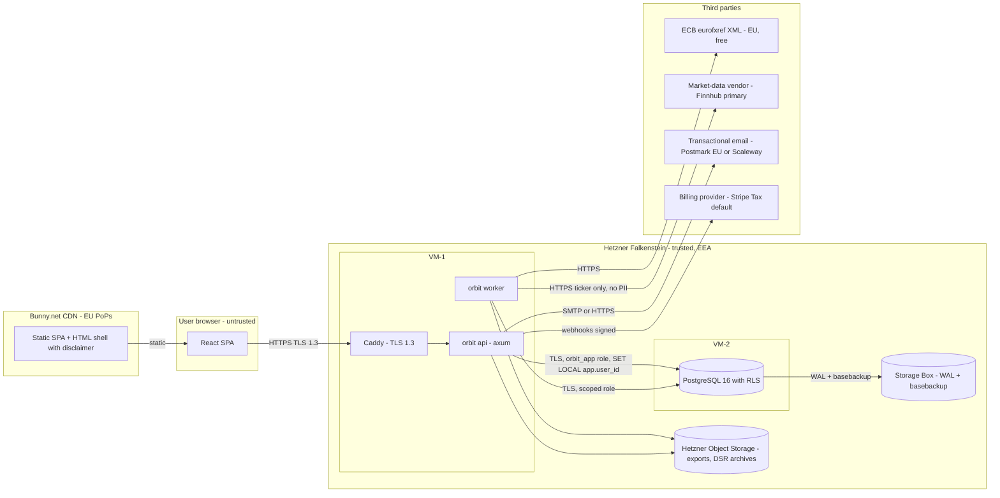

# Orbit v1 — Threat model

| Field       | Value                                                      |
|-------------|------------------------------------------------------------|
| Version     | 0.1-draft                                                  |
| Date        | 2026-04-18                                                 |
| Status      | Draft — security-engineer first pass                        |
| Owner       | security-engineer                                           |
| Scope       | Orbit v1 (Persona B Spain), greenfield — specifying, not auditing |
| Source spec | `/Users/ivan/Development/projects/orbit/docs/specs/orbit-v1-persona-b-spain.md` |
| Related ADRs| 001, 002, 003, 004, 005, 006, 007, 008 |
| Companion   | `security-requirements.md`, `security-checklist-slice-0.md` |

> This model covers Orbit v1 as currently specified. It is deliberately proportionate — B2C freemium, single-digit concurrent users at validation, <€200/mo infra ceiling — but firm on the regulatory floor: EU-only data plane, no-advice positioning, full traceability.

---

## 1. System overview

Orbit is a Rust-backed web SPA (ADR-001) deployed on Hetzner Falkenstein (ADR-002) serving Spain-tax-resident employees modeling US-denominated equity. The product computes tax estimates against versioned rule sets (ADR-004), consumes two external data feeds (ECB FX — ADR-007; a US equity quote vendor — ADR-006), and emits provenance-stamped PDF/CSV exports (ADR-008) destined for the user and their gestor.

### 1.1 Data-flow diagram

### 1.2 Trust boundaries

1. **Public internet to CDN / edge**: untrusted traffic; TLS 1.3 only; HSTS enforced.
2. **Edge to API**: untrusted HTTP entering the application — authn, authz, rate limits, input validation live here.
3. **API/worker to Postgres**: `orbit_app` non-superuser role without `BYPASSRLS`; every `[RLS]` table fails-closed when `app.user_id` unset (ADR-005).
4. **Application to third-party data plane** (ECB, market-data, email, billing): outbound-only, host-firewall allowlisted; only non-PII payloads cross.
5. **User to export artefact**: once a PDF/CSV leaves Orbit it is untrusted; integrity via hash + traceability ID + visible footer; confidentiality past this boundary is the user's responsibility.
6. **Operator to production**: Ivan (sole operator v1); MFA on every console; break-glass paths logged.
7. **Rule-set authoring pipeline**: YAML → Git PR → merge → deploy-time ingest → worker CLI promotion — integrity load-bearing for R-3/R-6.

### 1.3 Assets

| # | Asset | Classification | Why it matters |
|---|---|---|---|
| A1 | User credentials (password hashes, MFA secrets, session tokens) | Regulatory-Critical | ATO → full equity position + NDA-covered data. |
| A2 | Grant records (employer, ticker, share counts, strikes, vesting) | Financial-Personal + NDA-adjacent | Employer NDAs; leak is contractual breach for the user. |
| A3 | Tax identifiers (NIF/NIE), residency, Art. 7.p trips | Personal | GDPR-sensitive; directly identifying. |
| A4 | Computed tax liabilities, scenarios, sell-now results | Financial-Personal | Reveals wealth, planning, decision posture. |
| A5 | Export artefacts (PDF/CSV) | Financial-Personal | Bundles A2+A3+A4 in a portable document. |
| A6 | Rule-set content + content hashes | Regulatory-Critical (integrity) | Silent modification invalidates every dependent calc. |
| A7 | FX-rate history | Internal (integrity) | Poisoning affects every EUR output. |
| A8 | Market-data cache | Internal (integrity) | Same, for sell-now. |
| A9 | Audit log | Regulatory-Critical | AEAT prescription retention; tamper undermines traceability. |
| A10 | Billing / subscription state | Personal | Payment metadata via processor; Orbit holds only references. |
| A11 | Operator credentials | Regulatory-Critical | Full-system breach on compromise. |
| A12 | Backups (WAL + basebackup) | Regulatory-Critical | Copy of everything; encryption must match primary. |

### 1.4 Threat actors in scope

- **Opportunistic credential-stuffers** — H likelihood; rate limits + MFA + breached-password.
- **Targeted attackers** (ex-partner, employer investigator, competitor) — M/H.
- **Supply-chain adversaries** (npm/crates.io, GitHub Actions, market-data vendor) — M/H.
- **Insider / Ivan-as-operator** — low malice, non-trivial mistake-likelihood.
- **Regulators** (AEPD, CNMV) — posture must withstand scrutiny.
- **Out of scope**: nation-state, APT, physical datacenter access.

### 1.5 Explicit assumptions

- Hetzner datacenter/hypervisor posture intact.
- Postgres 16 RLS correctly implemented and patched.
- Let's Encrypt ACME issuance trustworthy.
- ECB XML authentic (TLS + EU domain).
- **No LLMs in v1** (spec confirmed). If that changes, re-threat-model (S37).
- `grants.notes`, `scenarios.name`, Art. 7.p `purpose` are free-text but NEVER interpreted downstream (no templating, no LLM, no shell, no eval).
- Rule-set YAML PRs require human CODEOWNER review; no bot auto-merge on `/rules/**`.

---

## 2. STRIDE threat catalogue

**L** = Likelihood (L/M/H), **I** = Impact (L/M/H), **P** = Priority (Blocker/Major/Minor/Informational), **v1?** = mandatory for v1 launch (Y/N/N-defer).

### 2.1 Authentication and account takeover

| # | Threat | STRIDE | CWE / OWASP | L | I | P | Mitigation | Residual | v1? |
|---|---|---|---|---|---|---|---|---|---|
| S1 | Credential stuffing on signin with leaked-password dumps. | S | CWE-521, A07 | H | H | Blocker | Per-IP + per-account rate limit with exponential backoff; breached-password check (HIBP k-anonymity) on signup and reset; CAPTCHA after N failed attempts; generic error (no user-enumeration); self-service lockout recovery. | Low — MFA stays voluntary in v1 per OQ-01. | Y |
| S2 | Password-reset token abuse (predictable/no expiry/reusable). | S/EoP | CWE-640, CWE-330 | M | H | Blocker | 128-bit CSPRNG tokens; single-use; 60-min expiry; invalidated on password change; generic "email sent" response regardless of address; per-email rate limit. | Low. | Y |
| S3 | Session hijack via XSS or cookie theft. | S/EoP | CWE-79, CWE-1004 | M | H | Blocker | Cookies `HttpOnly`, `Secure`, `SameSite=Lax`; strict CSP (no inline scripts, no non-self origins); no `dangerouslySetInnerHTML`; `grants.notes` rendered as text node; short-lived access tokens + rotating refresh tokens with server-side revocation via `sessions`. | Low. | Y |
| S4 | Session fixation. | S | CWE-384 | L | H | Major | Rotate session id on every privilege transition (signin, MFA step-up, password change); reject pre-existing session cookies during login. | Low. | Y |
| S5 | MFA bypass via reset flow. | EoP | CWE-287 | M | H | Blocker | Password reset does NOT bypass MFA. MFA removal requires re-auth + 24h cool-down + email notice to all known addresses; cool-down abortable. | Low. | Y |
| S6 | TOTP seed leak at enrolment (logged/in URL/plaintext at rest). | I | CWE-312 | L | H | Major | Seed shown once via QR; never logged; stored column-encrypted with key in secrets manager. Backup codes hashed (argon2id), one-shot. | Low. | Y |
| S7 | Email takeover → account takeover. | S | CWE-287 | L | H | Major | Offer MFA (not mandatory v1); notify on password/MFA change and new-device signin to all known addresses; "recent activity" panel. | Medium — externality; v1 accepts for non-celebrity persona. | Y |
| S8 | Voluntary-MFA adoption gap (OQ-01). | S | A07 | M | H | Major | Strong in-product nudge at paid upgrade, first export, 3rd signin; plan mandatory-for-paid in v1.1. **Needs product-owner decision.** | Medium — deliberately accepted. | N-defer (v1.1) |

### 2.2 Authorization and tenant isolation

| # | Threat | STRIDE | CWE | L | I | P | Mitigation | Residual | v1? |
|---|---|---|---|---|---|---|---|---|---|
| S9 | IDOR on any `[RLS]` entity — user A fetches user B's grant. | EoP/I | CWE-639, A01 | M | H | Blocker | Postgres RLS `USING + WITH CHECK` (ADR-005); `orbit_app` non-superuser role without `BYPASSRLS`; `Tx::for_user` helper is the only query handle, enforced by CI lint; integration tests assert cross-tenant returns 0 rows. | Very low. | Y |
| S10 | Forgotten `SET LOCAL app.user_id` → queries return 0 rows silently. | Repudiation/Avail | CWE-285 | M | M | Major | `SET LOCAL` inside the acquisition helper; lint forbids raw `pool.acquire()`; integration tests cover the "no GUC" path; alert on unexpected empty results in worker. | Low. | Y |
| S11 | Worker cross-tenant leak — task for user A mutates user B's rows. | EoP | CWE-284 | M | H | Major | Per-work-item `SET LOCAL`; cross-user jobs (DSR export, rule ingest) operate on non-RLS reference tables or `SET LOCAL` per user; code-review checklist for every worker task. | Low. | Y |
| S12 | Privilege escalation via subscription state manipulation. | EoP | CWE-285, A01 | L | M | Major | Entitlement derived server-side from `subscriptions.status`; paid checks in API endpoint, not only UI; billing webhook signatures verified. | Low. | Y |
| S13 | Confused deputy via support tooling. | I | CWE-441 | M | M | Major | No admin UI v1. Support queries use `orbit_support` role (BYPASSRLS, SELECT-only on scoped tables), audited via `pgaudit` or triggers; all support queries logged to an append-only support-access log separate from `audit_log`. | Medium — transparency is the control (§2.11). | Y |

### 2.3 PII and grant-data exposure

| # | Threat | STRIDE | CWE | L | I | P | Mitigation | Residual | v1? |
|---|---|---|---|---|---|---|---|---|---|
| S14 | PII / Financial-Personal in application logs (stack traces with grant values). | I | CWE-532, A09 | H | H | Blocker | Structured logging with field allowlist; never serialize `Grant`, `Scenario`, `Calculation`, `SellNowInput`, `Export`, `Money` to logs; redacted `Display`/`Debug`; CI lint that blocks `tracing::*!` on forbidden types; fixture test asserts 500 response body never contains numeric grant data. | Low if lint lands. | Y |
| S15 | PII in product analytics event payloads. | I | CWE-359, A09 | M | H | Major | §7.2 already forbids grant values / share counts / tax outputs. Analytics uses pseudonymous IDs; event schema whitelist-only, enforced at emit site via a typed builder. No third-party analytics SaaS processing PII v1; self-hosted Plausible/Umami if adopted. | Low. | Y |
| S16 | PII in crash-reporting / APM. | I | CWE-359 | M | H | Major | No SaaS crash reporter v1. If added later: EU-hosted; PII scrubber configured before rollout. | Low. | Y |
| S17 | PII in backups (basebackup + WAL on Storage Box). | I | CWE-311 | M | H | Major | App-level encryption for NIF/NIE, MFA seed, `grants.employer_name` / `notes` (S21); Hetzner at-rest encryption on volume; backup bundles additionally encrypted (age/libsodium) before upload; key NOT stored on the backup box. | Low. | Y |
| S18 | PII in PDF metadata / filenames. | I | CWE-200 | L | M | Minor | PDF `Title` embeds user identifier (deliberate per ADR-008 gestor UX); filename uses pseudonymous identifier; `Author` = "Orbit"; XMP carries traceability ID + hashes, NOT inputs. Export confirm modal warns the PDF contains identifying info. | Medium — accepted design; mitigated by confirm modal. | Y |
| S19 | Transactional-email leak (reset links, DSR-ready notices). | I | CWE-200 | L | M | Minor | Minimum identifying content; reset links don't embed email; DSR-ready email: "archive ready, sign in to download" — no user detail. Email provider documented in sub-processor register. | Low. | Y |
| S20 | Support-case data leak (operator quotes a grant value in a reply). | I | CWE-359 | M | M | Minor | Canned templates; runbook policy "reference by ID, never quote numbers back"; documented. | Medium — process control only. | Y |
| S21 | NDA-sensitive `employer_name` / `notes` leak via logs, backups, or export metadata. | I | CWE-200, A09 | M | H | Major | Treated as Financial-Personal; same logging rules as S14; column-level encryption optional v1 (accepted), mandatory if an external backup target is added later. | Medium — accepted v1. | Y |

### 2.4 Rule-set integrity (Orbit-specific, load-bearing)

| # | Threat | STRIDE | CWE | L | I | P | Mitigation | Residual | v1? |
|---|---|---|---|---|---|---|---|---|---|
| S22 | Silent rule-set swap — active rule content altered, old calcs now replay differently. | T | CWE-345, CWE-353 | L | H | Blocker | ADR-004 immutability: active is append-only; corrections publish successor. Postgres row-level trigger rejects `UPDATE` on `rule_sets WHERE status='active'`. Content hash at publish; calc rows carry denormalized `rule_set_content_hash`; periodic replay sampler. | Very low — three independent defences. | Y |
| S23 | Malicious or erroneous YAML PR merged. | T | CWE-494, A08 | L | H | Blocker | Branch protection on `main`; `/rules/**` requires CODEOWNER review; signed commits recommended; CI runs rule-set regression suite as required check; two-step publish (merge → worker CLI promotion). **Needs product-owner decision**: acceptable with single operator or engage external reviewer on rule PRs? | Low. | Y |
| S24 | Content-hash tampering in DB (adversary inserts a hash matching rewritten data). | T | CWE-345 | L | H | Major | Hash computed by worker on ingest from canonical YAML, not trusted from YAML file. CI step re-hashes every `active` row vs Git YAML source; engine refuses rule set whose runtime-computed hash mismatches stored hash. | Low. | Y |
| S25 | Engine non-determinism leaks into results (HashMap order, locale, time). | T | CWE-1284 | M | M | Major | Lint against `std::collections::HashMap` in calc crates (use `BTreeMap`); `LC_ALL=C` in worker; `now()` injected; replay sampler catches escapes. | Low. | Y |
| S26 | `proposed` rule set used in a user-visible calc (state-machine skipped). | T | CWE-284 | L | M | Minor | Calculator's loader only accepts `status='active'`; `proposed` usable only via a build-feature-gated internal test path disabled in prod. | Low. | Y |

### 2.5 Market-data and FX feed integrity

| # | Threat | STRIDE | CWE | L | I | P | Mitigation | Residual | v1? |
|---|---|---|---|---|---|---|---|---|---|
| S27 | Vendor feeds wrong price (bug/prank/malice). | T | CWE-345 | L | M | Major | Sanity-check: reject a quote whose abs change vs cached prior >30% (configurable). On reject: treat as vendor-unavailable per ADR-006. | Medium — in-band malicious price undetectable; protection is range-first UX + "not advice" disclaimer. | Y |
| S28 | ECB XML MITM / spoof. | T | CWE-295 | L | M | Minor | TLS with full cert chain validation; content-type + schema check; reject `<Cube time>` in the future or > MAX_FALLBACK_DAYS old. | Low. | Y |
| S29 | Market-data / ECB API key leak (in repo, logs). | I | CWE-798, A07 | M | M | Major | Secrets in OS secret store / env, not repo; gitleaks in CI; rotate annually and on suspected compromise. | Low. | Y |
| S30 | Quote-cache poisoning via crafted misrouted symbol. | T | CWE-20 | L | M | Minor | Ticker whitelist regex `^[A-Z0-9.\-]{1,8}$`; cache key is normalized ticker, not user input. | Low. | Y |
| S31 | FX-rate override abuse — user games their own numbers. (Not a security threat; product risk.) | — | — | — | — | Informational | §7.7 bands at 0% and 3% regardless; override labelled in export. | — | Y |
| S32 | Vendor outage → user computes on stale data without realizing. | T (UX integrity) | CWE-672 | M | M | Major | ADR-006 30-min staleness threshold; "quote unavailable — enter manually"; sell-now blocks on stale by default; override widens bands; audit-log carries stale-quote flag. | Low. | Y |

### 2.6 Export artefact integrity

| # | Threat | STRIDE | CWE | L | I | P | Mitigation | Residual | v1? |
|---|---|---|---|---|---|---|---|---|---|
| S33 | Forged PDF presented as Orbit-signed. | S/T | CWE-345 | M | M | Major | Visible traceability ID + `result_hash` + `inputs_hash` per-page (ADR-008); **auth-scoped verification endpoint** `GET /verify/<traceability_id>` (user signed in, their own export). Cryptographic PDF signing (PAdES/PGP) deferred to v1.1. | Medium — accepted v1; backlog-tracked. | Y (endpoint); signing N-defer |
| S34 | Tampered XMP metadata disguises provenance. | T | CWE-345 | L | M | Minor | XMP is a hint; source of truth is `exports` row + verification endpoint. Mismatched XMP fails verification. | Low. | Y |
| S35 | Traceability IDs enable enumeration. | I | CWE-200 | L | L | Informational | UUIDv4 128-bit unguessable; verification endpoint requires auth. | Low. | Y |
| S36 | Export retention (7y) vs right-to-erasure contradiction. | — | GDPR Art. 17 | — | — | Major | ADR-008 default: erasure overrides 7-y retention; `calculations` pseudonymized, blobs deleted. **Confirmed correct posture**: PDFs carry user identifier in `Title`, pseudonymizing the blob is not defensible. The 6-y audit retention is separately justified by legal obligation. | Low. | Y |

### 2.7 Abuse of the "decision-support, not advice" boundary

| # | Threat | STRIDE | CWE | L | I | P | Mitigation | Residual | v1? |
|---|---|---|---|---|---|---|---|---|---|
| S37 | Prompt injection via user text (`grants.notes`, `scenarios.name`, Art. 7.p `purpose`). | T/EoP | CWE-94 | L | L | Informational | v1 does NOT use LLMs. User text stored, never interpreted. Re-threat-model if this changes. | None in v1. | Y (architectural abstinence) |
| S38 | UI copy drift into advice territory (a developer adds "Recommended action"). | Reg | — | M | H | Major | Product-copy review checklist per §7.4 + R-1: no "should", "recommend", "we suggest", "best"; code-review item; pen-test vendor asked to review UX copy for CNMV positioning pre-paid launch. | Medium — governance. | Y |
| S39 | Output scraping to reconstruct NDA-sensitive employer data. | I | — | L | M | Minor | CSV import + export rate limits; bot protection on signup; ToS forbids use on data the user doesn't control. | Medium. | Y |
| S40 | Export forwarded to unintended recipient. | I | — | M | H | Informational | Out of Orbit's technical control; export confirm modal warns; PDF footer reminds recipient of confidentiality. | Medium — user responsibility. | Y |

### 2.8 Denial of service

| # | Threat | STRIDE | CWE | L | I | P | Mitigation | Residual | v1? |
|---|---|---|---|---|---|---|---|---|---|
| S41 | Compute-bomb on sell-now / scenario endpoints. | D | CWE-400, CWE-1333 | M | M | Major | Input caps (≤100 lots/sell-now, ≤50 scenarios/user, ≤1,000 CSV rows per OQ-04); 500ms wall-clock budget with circuit breaker; per-user rate limits (e.g., 60/min, 600/h). | Low. | Y |
| S42 | Regex DoS on free-text validation. | D | CWE-1333 | L | L | Minor | Rust `regex` crate is linear-time; length caps (2,048 chars notes, 256 employer_name). | Low. | Y |
| S43 | Market-data-fetch amplification. | D/abuse | CWE-770 | M | M | Major | Shared 15-min cache (ADR-006); ticker lookup requires user to hold a grant on that ticker; per-user sell-now rate limit; in-flight coalescing. | Low. | Y |
| S44 | PDF rendering DoS. | D | CWE-770 | M | M | Major | Export is paid (gated); per-user limit (e.g., 20/h, 100/d); worker `CPUQuota` (ADR-002); queue depth bounded. | Low. | Y |
| S45 | DSR-export amplification via mass signups. | D | CWE-770 | L | L | Minor | DSR rate-limited per user (1/d); signup behind CAPTCHA + email verification; free accounts' DSR archive excludes exports. | Low. | Y |
| S46 | Volumetric edge DDoS. | D | — | L | M | Informational | Bunny.net absorbs static; Caddy conn limits; Hetzner baseline. Revisit at paid-tier scale. | Medium. | N-defer |

### 2.9 Supply chain

| # | Threat | STRIDE | CWE | L | I | P | Mitigation | Residual | v1? |
|---|---|---|---|---|---|---|---|---|---|
| S47 | Malicious crates.io / npm package. | T | CWE-1357, A08 | M | H | Blocker | `cargo deny` + `cargo audit` + `npm audit` in CI; lockfiles committed; Dependabot/renovate weekly batches; no `*`/`latest` ranges; CycloneDX SBOM per release. | Low. | Y |
| S48 | Compromised GitHub Action (`@v3` floating tag). | T | CWE-829 | M | H | Major | All third-party Actions pinned to commit SHA; CODEOWNERS on `.github/workflows/`; minimum-privilege `GITHUB_TOKEN`; secrets behind GitHub Environments with required reviewers for prod. | Low. | Y |
| S49 | Compromised CI runner steals secrets. | I/EoP | CWE-522 | L | H | Major | Secrets in GitHub Environments with required reviewers on prod; build-only vs deploy job separation; GitHub-hosted runners in v1. | Medium. | Y |
| S50 | Rule-set pipeline compromise — bad YAML passes tests. | T | CWE-494 | L | H | Blocker | See S23. Additionally: every published rule set auto-posts a diff summary to an ops log; anomalous numeric diffs trigger manual review. | Low. | Y |
| S51 | Docker base image compromise. | T | CWE-1357 | L | H | Major | Base images pinned by digest; prefer `cgr.dev/chainguard/static` or distroless; Trivy in CI; weekly rebuild. | Low. | Y |

### 2.10 Insider and operator threats

| # | Threat | STRIDE | CWE | L | I | P | Mitigation | Residual | v1? |
|---|---|---|---|---|---|---|---|---|---|
| S52 | Operator reads a user's grants via direct DB access. | I | — | — | M | Major | Dedicated `orbit_support` role (SELECT-only on scoped tables) with pgaudit logging; every support query leaves an audit row; privacy policy truthful about operator access. Move to JIT at ≥2 operators. | Medium — transparency is the control. | Y |
| S53 | Operator accidentally corrupts rule-set data (`UPDATE rule_sets`). | T | CWE-693 | M | H | Blocker | Postgres trigger rejects `UPDATE` where `status='active'`; separate migration role; runbook forbids manual edits; migration build fails if migration mutates an active rule. | Low. | Y |
| S54 | Operator credential compromise (Hetzner, DNS, CDN, GitHub, registrar, email, billing). | S/EoP | CWE-522 | L | H | Blocker | MFA everywhere; hardware security key preferred; password manager; documented recovery; no shared creds. | Low. | Y |
| S55 | Secret committed to repo (`.env`, PEM). | I | CWE-798 | M | H | Blocker | gitleaks pre-commit + CI; `.gitignore` covers `.env*`, `secrets*`, `*.pem`; history scanned on deploy; rotate-on-leak runbook. | Low. | Y |
| S56 | Break-glass access without oversight. | Rep | — | H | M | Major | Monthly calendar-scheduled self-audit of `orbit_support` log, initialed into the change-management log; cross-review at ≥2 operators. **Needs product-owner decision**: accept or engage external auditor pre-paid launch? | Medium — weak but proportionate at single-operator scale. | Y |

### 2.11 GDPR / LOPDGDD operational

| # | Threat | STRIDE | L | I | P | Mitigation | Residual | v1? |
|---|---|---|---|---|---|---|---|---|
| S57 | Right-to-erasure non-compliance — orphaned PII in backups, object storage, email-provider logs. | Reg | M | H | Blocker | ADR-005 cascade on PII; ADR-008 deletes export blobs on erasure; backups roll off per retention (≤30 days live, ≤90 cold); email-provider 14-day bounce-log rollover; sub-processor register documents each. Pseudonymization of `calculations`/`audit_log` under legal-obligation retention, disclosed in privacy policy. | Low — backups within retention window accepted under Art. 17(3)(b). | Y |
| S58 | DSAR SLA miss (Art. 12(3), 30d). | Reg | L | H | Major | §7.2 target 7 days via self-service; `dsr_requests` SLA monitor alerts at D+20; escalation runbook. | Low. | Y |
| S59 | Cross-border transfer violation — sub-processor moves data to US. | Reg | M | H | Major | Sub-processor register published; per-integration review for EU residency or SCCs+TIA; Postmark (US-HQ) + Finnhub (US-HQ) receive zero PII and that posture is documented; vendor-residency change triggers re-review. | Low. | Y |
| S60 | Breach-notification SLA miss (72h to AEPD, Art. 33). | Reg | L | H | Major | IR runbook with 72h timer from "aware"; templated AEPD + user notifications (ES/EN); annual drill. | Low. | Y |
| S61 | DPO / privacy-contact ambiguity (OQ-02). | Reg | L | M | Minor | Privacy contact (email + postal address for written DSARs) published day one; DPO-appointment threshold reviewed at 10k MAU. **Product-owner decision at trigger.** | Low v1. | Y |
| S62 | Cookie-consent non-compliance with AEPD 2023 guidance. | Reg | M | M | Minor | No non-essential cookies v1; if added, AEPD-compliant banner (Aceptar/Rechazar/Configurar at equal prominence, no pre-ticks, consent logged). | Low. | Y |
| S63 | Audit-log pseudonymization deemed insufficient anonymization. | Reg | L | M | Informational | ADR-004/005 follow-up. Posture: pseudonymization + access controls on `audit_log` + payload field allowlist. Fallback: full scrub of user-identifiers on erasure (breaks one reconstruction use case; acceptable). | Low. | Y |

---

## 3. Abuse cases (narrative)

- **AC-1 The credential-stuffer** — bot sweeps leaked dumps; defeated by S1 rate limits, breached-password check, MFA-enabled accounts, account lockout. Residual: single-factor accounts with a fresh-leaked password until S8 hardens in v1.1.
- **AC-2 The targeted ex-partner** — knows email + weak password; MFA re-challenge after reset (S5), change notifications (S7) give the victim 24h to intervene.
- **AC-3 The compromised dependency** — four-levels-deep Rust crate exfiltrates env vars on build; S47 advisory scanning + S49 environment gates limit impact.
- **AC-4 The malicious rule-set PR** — nudges a Madrid rate; S23 CODEOWNERS + test-suite snapshot fixtures (known taxpayer totals) + S24 hash-drift detection + two-step promotion catch it.
- **AC-5 The "this isn't advice, right?" lawsuit** — user blames Orbit for a market loss; defence is the four-layer disclaimer, R-1/R-2 mitigation, rule-set stamping, export traceability, checked-box at export. Ongoing governance: S38 copy review.
- **AC-6 Insider error** — Ivan tries `UPDATE rule_sets` to "fix" a typo; S53 trigger rejects; successor rule set is the only path.
- **AC-7 The forwarded export** — emailed to gestor and intercepted; S33 hash-and-verify; confidentiality past user-to-gestor boundary explicitly not Orbit's responsibility.
- **AC-8 The "free reconnaissance" bot** — creates account, imports stolen CSV, exports; S39 bot protection + ToS; scale-limited but not hard-defended; accepted.

---

## 4. Existing & proposed controls (grouped)

- **Authn/session**: email+password (argon2id), TOTP MFA optional v1 / mandatory v1.1, short-lived access + rotating refresh, revocation, device list. (S1–S8)
- **Authz/tenant isolation**: Postgres RLS `USING + WITH CHECK`, non-superuser role, `Tx::for_user` + CI lint, integration tests. (S9–S13)
- **Input validation**: Typed DTOs with `serde` + `validator`; free-text length caps; ticker regex; linear-time `regex`; CSV size + row-level validation. (S41, S42)
- **Cryptography**: TLS 1.3 floor (reject <1.2); HSTS preload-eligible post-GA; argon2id passwords; column-level encryption for NIF/NIE + TOTP; AES-256-equivalent at rest (Hetzner + app-layer for sensitive cols); backup bundles separately encrypted. (S6, S17)
- **Logging/audit**: structured logs with field allowlist; append-only `audit_log` with IP hash + traceability ID; 6y retention separate from PII; access-restricted; monthly review. (S14, S56, S63)
- **Secrets**: OS-level secret file v1; GitHub Environments for deploy; gitleaks in CI; annual rotation + on-compromise. (S29, S55)
- **Dependencies/supply chain**: `cargo audit`/`deny`, `npm audit`, CycloneDX SBOM, Actions SHA-pinning, Docker digest-pinning + Trivy. (S47–S51)
- **Infrastructure**: Hetzner Falkenstein EEA; Caddy TLS 1.3 + Let's Encrypt; host firewall deny-default; Bunny.net EU-only PoPs; Postgres never public. (S59)
- **Rule-set + export integrity**: ADR-004 immutability + hash + replay sampler + Postgres trigger; ADR-008 traceability + per-page footer + XMP + auth-scoped verification endpoint. (S22–S26, S33–S36)
- **GDPR/LOPDGDD**: sub-processor register, DPA for paid, DSR self-service + 30d SLA, cascade erasure + export deletion + audit pseudonymization, AEPD breach runbook. (S57–S63)

---

## 5. Summary prioritization

- **Blockers** (before v1 launch): S1, S2, S3, S5, S9, S14, S22, S23, S47, S50, S53, S54, S55, S57.
- **Major** (before paid launch): S4, S6, S7, S10, S11, S12, S13, S15, S16, S17, S21, S24, S25, S27, S29, S33, S38, S41, S43, S44, S48, S49, S51, S52, S58, S59, S60.
- **Minor**: S18, S19, S20, S26, S28, S30, S34, S39, S42, S45, S61, S62.
- **Informational**: S31, S35, S37, S40, S46, S63.

---

## 6. Open items (owned)

| # | Item | Owner | Due |
|---|---|---|---|
| O-1 | Confirm audit-log pseudonymization is AEPD-defensible vs stricter scrub. | security + legal | Before paid launch |
| O-2 | Confirm vendor ToS (Finnhub, Postmark) at contract time; log verified clauses in a vendor-licensing note. | Ivan + security | Before first paid signup |
| O-3 | Product-owner decision on MFA-mandatory-for-paid in v1 vs v1.1 (S8). | product-owner | Before paid launch |
| O-4 | Product-owner decision on rule-set PR reviewer model at single-operator stage (S23, S56). | product-owner | Before first `active` rule set |
| O-5 | Legal opinion on CNMV/MiFID II positioning (R-1) — confirms four-layer disclaimer pattern (S38, AC-5). | legal + product-owner | Before paid launch |
| O-6 | Pen-test engagement scoped and booked. | Ivan | Before paid launch (§7.9) |
| O-7 | DPO appointment threshold review (OQ-02, S61). | security + legal | At 10k MAU or large-scale processing change |
| O-8 | IR runbook + 72h breach-notification drill. | security | Before paid launch |

---

## 7. Threats deferred (explicit, v1.1+)

- Cryptographic PDF signing (PAdES / detached PGP) — S33.
- Mandatory MFA for paid — S8.
- Public (unauthenticated) verification endpoint for exports — S33.
- JIT / cross-reviewed operator access — S52, S56.
- Volumetric DDoS protection — S46.
- Twelve Data standby integration — ADR-006 hardening.

*End of threat model.*
